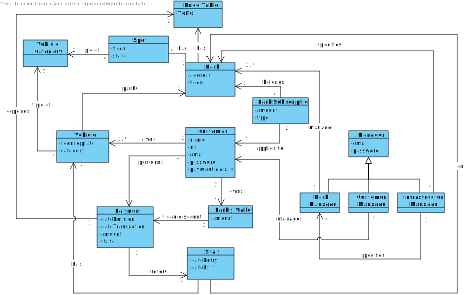
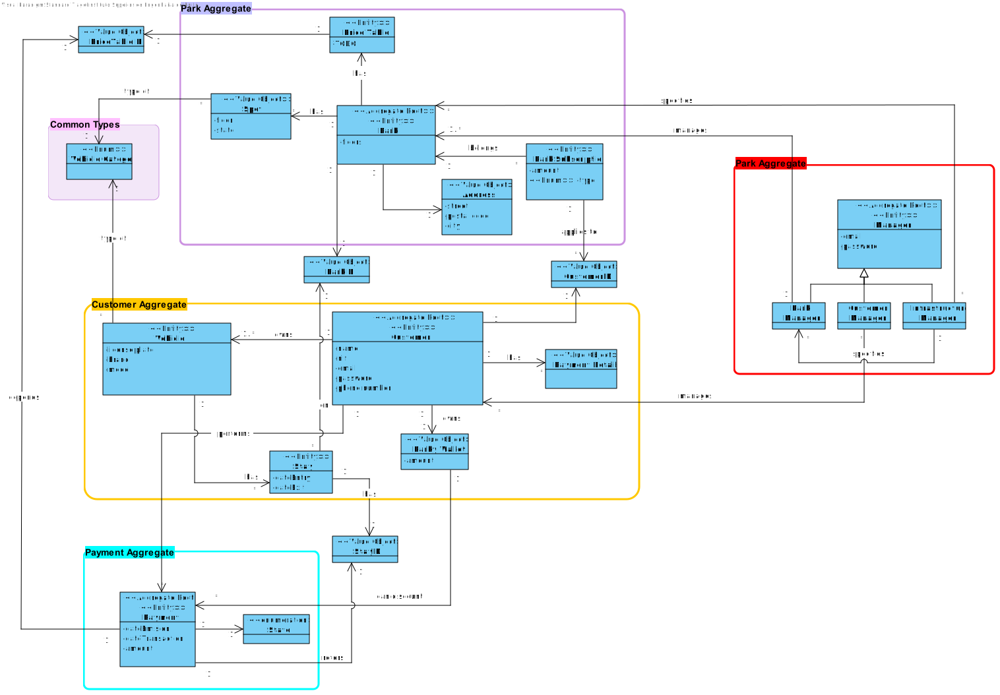
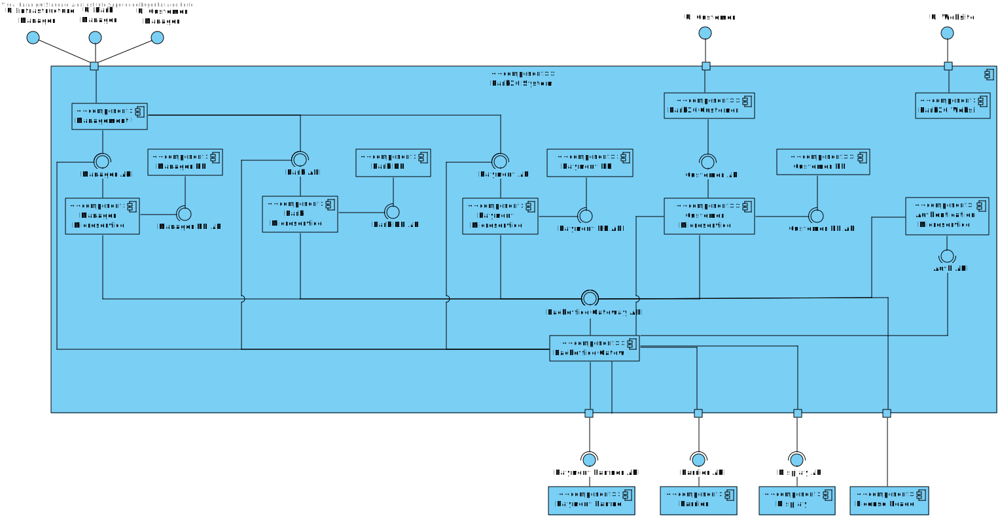

# Park20_23-24
Group project for LABDSOF subject of the Master in Software Engineering course at ISEP. 

Park20 is a (fictional) company operating in the area of car and motorcycle parking.
Recently the company decided to approach a new way for its customers to use its parks providing a new and improved customer experience.

**Important note**: The project itself is very extense, and for academic purposes only a prototype with a limited number of features and components was implemented. It's not fully implemented nor there are plans to fully develop it in the future.

Prototype features (Park configuration is to be done by bootstrapping the database):
- Simulation of the barrier software
- Simulation of the display software
- User and vehicle registration
- Nearby parks and their availability according to user’s registered vehicle type
- Park entrance and exit
- PARKY wallet (not fully implemented)
- Integration with map software
- Manage price tables
- Enable/disable parking spots
- Backoffice report and analytics (at least one report with filtering/sorting)

# Domain Model #

# DCDDD #

# Level 2 #

## Logical View ##

## Architecture and Technology Definition 

The Park20 system is composed of various parts as seen in the logical view.

The system's frontend is divided into 3 separate applications:

- __Park20 Website__ - An angular SPA to show commercial info and the download links for the Customer UI.
- __Park20 Customer UI__ - An android app for the customer to use the system. **NOTE**- It is implemented as an angular app, that would then be a Progessive web app (PWA)
- __Park20 Management UI__ - An interface to allow the managers to interact with the system. 

The system's backend is divided into:

- __Microservices__ - Each aggregate has a corresponding microservice responsible for aggregate related functionalities. Each microservice was implemented using Springboot. There is also an authentication microservice.
- __Databases__ - Each aggregate has a corresponding database.
  - Customer database - Uses PostgreSQL due to the various intra-aggregate relationships;
  - Manager database - Uses PostgreSQL;
  - Payment database - Uses PostgreSQL;
  - Park database - Uses PostgreSQL;

- __Message Broker__ - The inter-microservice communication will be handled through RabbitMQ to improve the reliability and scalibility of the system.
- __Backoffice Gateway__ - An API gateway will be used to aggregate the microservices and reroute the requests to and from the system. 

## System Dependencies

The Park20 system will interact with the following external components:

- Park barriers
- Park displays
- Park license plate readers

For academic purposes, simple programs were implemented to emulate the behaviour of the external components.

And will depend on the following external systems:

- Payment process provider

Since the Park20 system depends on external systems it should have plans to handle points of failure in said systems:

- The Payment process provider should be carefully selected to have the capability of saving payment requests during downtime;

## System Assumptions

In order for the system to be able to fully deliver all it's functionalities it operates under the following assumptions:

- Internet Connection: In order to communicate with the system, either as a customer or as a manager, an internet connection is required. Nonetheless the system should be able to allow the customer to enter the park regardless of having an internet connection or even having a device if the vehicle is already registered.

- Device with GPS tracking: In order for the system to suggest nearby parks accounting for some variables (like traffic), it requires a GPS enabled device. The system should still function, albeit with less functionalities should the device not have GPS enabled.

## Requirements

These are all the High Level Requirements for the project.

**REMINDER**: Only a small portion of these are actually implemented. 

1. Park management
    - Configure the park (locations, floors, GPL spots, Electric charge spots, general spots…) :white_check_mark: (Partially)
    - Assign park managers :white_check_mark:
    - Manage price tables :white_check_mark:
    - Temporarily Enable/Disable parking spots :white_check_mark:
    - Live view of parks’ occupancy level
    - Reporting and analytics on parking usage :white_check_mark:
2. Customer management
    - Show customers with outstanding payments
    - Temporarily or permanently block a customer
    - Rank customers based on park usage :white_check_mark:
    - Rank customers based on outstanding debits status
    - Message one customer
    - Bulk message customers (e.g., to inform of price table changes)
3. PARKY wallet management
    - Define PARKY thresholds :white_check_mark:
    - Report and analytics
    - Bulk assign PARKY coins to users :white_check_mark:
4. Mobile application for the park user
    - Customer and vehicle registration :white_check_mark:
    - Personal data management 
    - Payment method management :white_check_mark:
    - Add a new vehicle :white_check_mark:
    - Change Vehicle
    - Check activity log
    - Show outstanding payments
    - Map of nearby parks showing the number of available parking spots / occupancy level :white_check_mark: 
    - Monthly subscription management
    - Suggestions of parking places based on current traffic and learned habits
    - Check PARKY wallet :white_check_mark:
    - Invite user
    - View notifications
    - Cancel account
5. Park entrance/exit barriers
    - Optical license plate reader :white_check_mark:
    - When a registered license plate is recognized by the reader in one entrance, the barrier opens to allow the registered user to enter the park. :white_check_mark:
    - Display to show welcome and warning messages :white_check_mark:
      - When no car is near the entrance the display shows a general commercial message and the number of available parking spots :white_check_mark:
      - When a car approaches the entrance and the license plate is read, the display shows a personalized welcome message :white_check_mark:
      - When a car approaches the exit and the license plate is read, the display shows a personalized goodbye message and shows the cost of the parking :white_check_mark:
6. Park20 Web site
    - Landing page with commercial info
    - App download links
